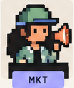
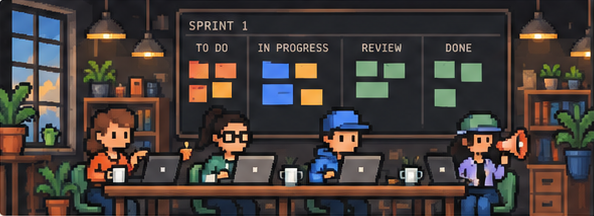

<div align="center">


### Configure AI teams that build together.

Farik runs a small team of AI agents on your product — a Product Manager, a Scrum Master, an
Architect, a Developer and a Marketing Specialist — under a governance harness that decides, in
code, what they are allowed to do. Your agents don't need more autonomy. They need a contract.

[](https://github.com/abdshaat/Farik/actions/workflows/check.yml)
[](LICENSE)
[](rust-toolchain.toml)
[](#status)

</div>

---

> ### Status
>
> **Farik is pre-release.** The governance harness, the agent runtime and a five-role team with
> sprints and a team channel are built and tested, and run from the command line today. The web app,
> made for people who never open a terminal, is being designed now. There is no installable release
> and no stable API. Star the repository if you want to hear when there is.

## The problem

Point a swarm of agents at a repository and watch what breaks. It is rarely the model.

It is that nothing stops the team from talking itself into a rewrite. That three weeks later nobody
can reconstruct why a file changed, or what it cost. And that the agent which wrote the code is the
same one that declares it correct.

The usual fix is a longer system prompt. But a prompt that says *never push to `main`* is a
suggestion, and a model having a bad day will take it as one.

## The approach

Farik puts the rules in code that runs between the agent and the tool, where a bad day cannot reach
them.

- **A contract before any work.** No agent touches a task until it has a written contract: intent,
  exit criteria with a verification method for each, a budget, a risk level, an explicit
  out-of-scope list, and a named reviewer. No contract, no start.

- **Nobody grades their own homework.** The reviewer is never the assignee, and verification runs
  in a fresh session that never sees the author's transcript — only the contract, the diff, and the
  tools to run the criteria. A reviewer that reads *"I ran the tests and they passed"* is measurably
  worse than one that runs the tests.

- **Governance is code, not prompts.** A deterministic governor checks every permission, budget,
  iteration limit and path allowlist. Agents propose; the governor disposes. Prompt injection
  through the repository is assumed: an injected instruction can make an agent *request* a push, and
  the request comes back denied.

- **Bounded by default.** Every session has a token budget, a wall-clock limit, a tool-call limit
  and an iteration limit. Hitting one raises an escalation to you. Nothing runs away.

- **A complete audit trail.** Every tool call, state change, message and dollar lands in an
  append-only log. Contracts and decisions are plain files in your repository, so they diff and
  review like code.

- **Local first, your key.** The orchestrator runs on your machine, agents execute in a sandbox on
  your machine, and your code never leaves it.

## See it work

Here is the command line as it stands today, on a real repository:

```console
$ farik init
last commit today
wrote .farik/team.yaml: product-manager, developer
no criteria: nothing in this repository says how it is tested
```

Farik scans the repository, writes `.farik/`, and seeds a library of exit criteria from whatever
the project says about how it is tested. Now file a request:

```console
$ farik task create request.yaml
FRK-1 filed as a draft request: Show the board without a database client
farik triage says whether it is large or small; nothing starts before that (5.16)

$ farik triage FRK-1 small --reason "One command, one file."
FRK-1 is small: task. One command, one file.

$ farik board
FRK-1     task  draft       low    Show the board without a database client
```

Every contract can be read back with everything that happened to it:

```console
$ farik task show FRK-1
FRK-1 Show the board without a database client
draft task, low risk

intent: A person can read the board without opening a database.

requirements
  R1 The board prints one line per task.
exit criteria
  C1 Every test in the workspace passes. [test]

events
     4 2026-09-21T18:05:51Z task.created
     5 2026-09-21T18:05:51Z request.triaged
```

And nothing happens that the log does not record:

```console
$ farik log
   1 2026-09-21T18:05:37Z team.updated       -
   2 2026-09-21T18:05:37Z project.scanned    -
   3 2026-09-21T18:05:37Z criteria.updated   -
   4 2026-09-21T18:05:51Z task.created       FRK-1
   5 2026-09-21T18:05:51Z request.triaged    FRK-1
```

Add `--json` to any command when you want to pipe it somewhere.

## How a task moves

A request becomes an epic or a single task. Nothing starts until its contract is ready, and nothing
is accepted until a reviewer has run every criterion and written down the evidence.

```
draft ──▶ refining ──▶ ready ──▶ assigned ──▶ in_progress ──▶ verifying ──▶ accepted
             │            │          │             │              │
             │            │          │             ▼              ▼
             │            │          │          blocked        rejected ──▶ in_progress
             │            │          │             │                          (bounded)
             ▼            ▼          ▼             ▼
         escalated    escalated  escalated ──▶ you decide ──▶ any state, or cancelled
```

The governor is the only thing that can move a task between the states it owns, and every refusal
comes with a reason. When an agent runs out of budget, gets blocked, or fails review three times,
the task escalates to you rather than grinding on.

## Meet the team

You assemble the team yourself: two to seven agents, each with a name, an avatar and one of five
roles. Each gets its own model settings, tools, MCP servers and skills. Two developers is the
common case.

<table align="center">
<tr>
<td align="center" width="20%"><br><b>Product Manager</b><br><sub>Defines vision and priorities, and turns your requests into contracts.</sub></td>
<td align="center" width="20%"><br><b>Scrum Master</b><br><sub>Keeps the team aligned and unblocked, and runs the sprint.</sub></td>
<td align="center" width="20%"><br><b>Architect</b><br><sub>Holds the shape of the system and reviews the work. Its character is coming.</sub></td>
<td align="center" width="20%"><br><b>Developer</b><br><sub>Builds, tests and ships features. The only one who changes code.</sub></td>
<td align="center" width="20%"><br><b>Marketing Specialist</b><br><sub>Creates content and drives growth.</sub></td>
</tr>
</table>

<p align="center">

</p>

## Getting started

There is no release yet. To build from source you need [`rustup`](https://rustup.rs), which reads
`rust-toolchain.toml` and installs the pinned toolchain on first use.

```console
$ git clone https://github.com/abdshaat/Farik.git
$ cd Farik
$ cargo build --release
```

The binary lands at `target/release/farik`. Point it at any git repository and run `farik init`.

### Commands

| Command | |
|---|---|
| `farik init` | Make the repository a Farik project, or rescan an existing one |
| `farik task create <file>` | File a YAML contract as a draft request |
| `farik task show <id>` | Show one contract and everything that happened to it |
| `farik triage <id> <large\|small>` | Record how big a request is |
| `farik contract lock <id>` | Take a contract from the team; agents may then only record results |
| `farik contract unlock <id>` | Give the contract back to the team |
| `farik board` | Show the lifecycle, one line per task |
| `farik log` | Show the event log; filter by `--task`, `--kind`, `--limit` |
| `farik rules show` | Print the team rules every action is held to |
| `farik criteria list` | Print every criterion a contract may refer to by name |
| `farik doctor` | Report every way the files and the log disagree |

## Roadmap

- **Done** — the governance harness, the command line, the agent runtime, and the team: five roles,
  sprints, spending limits, the team channel and its ceremonies.
- **Now** — the brand, then a web app built for people who never open a terminal: set up a team in a
  wizard, approve plans and accept work from a plain-language summary, with the code changes one
  click away.
- **Next** — a desktop app with the pixel-art office you can watch the team work in.
- **Then** — per-agent MCP servers and skills, one-on-one conversations, the audit viewer, and the
  public launch; native iOS and Android apps after that.

Farik is Apache 2.0 and always will be. A hosted tier is planned for people who would rather not run
it themselves, but nothing that makes the agents safer or more controllable will ever be paid — a
governance layer you cannot audit is not one you should trust with your repository.

## Contributing

Farik holds itself to the discipline it imposes on the agent teams it runs: no code before a failing
test, no completion claim without pasted evidence, and nobody approves their own pull request. Start
with [CONTRIBUTING.md](CONTRIBUTING.md); it is short.

The [specification](docs/SPEC.md) is the place to argue with the design, and the
[architecture decisions](docs/decisions/) record why things are the way they are. Issues and
discussions are welcome, especially from anyone who has watched an agent team fail in a way this
harness would not have caught.

## License

[Apache 2.0](LICENSE).
