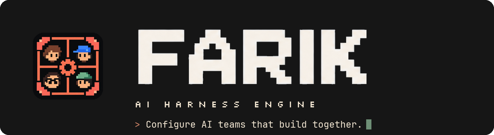
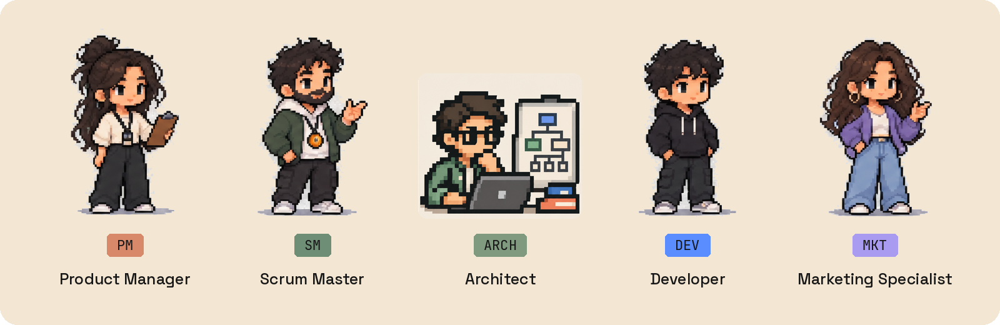
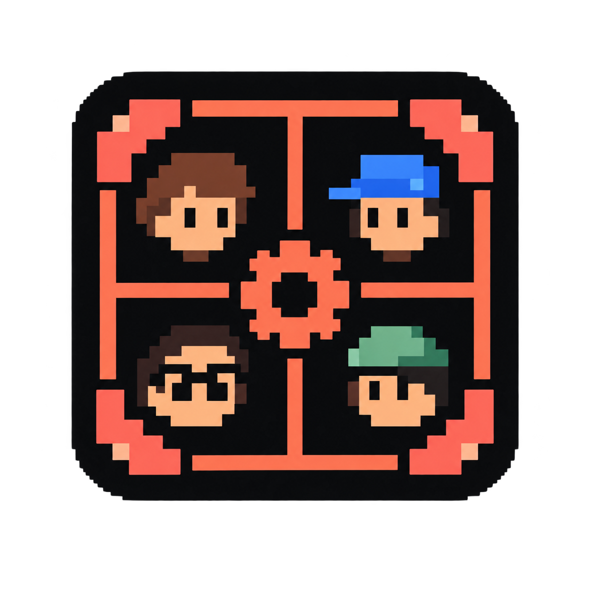

<div align="center">



<br>

**A team of AI agents for your product, held to contracts in code.**

[](https://github.com/abdshaat/Farik/actions/workflows/check.yml)
[](LICENSE)
[](rust-toolchain.toml)
[](#status)

[Why Farik](#why-farik) &nbsp;|&nbsp; [How it works](#how-it-works) &nbsp;|&nbsp; [The team](#meet-the-team) &nbsp;|&nbsp; [Quick start](#quick-start) &nbsp;|&nbsp; [Roadmap](#roadmap) &nbsp;|&nbsp; [Contributing](#contributing)

</div>

Farik runs a small team of AI agents (a Product Manager, a Scrum Master, an Architect, a Developer and a Marketing Specialist) against one git repository. They plan, build, review and ship together. A governance harness sits between every agent and every tool and decides, in code, what each of them may do. Your agents don't need more autonomy. They need a contract.

## Status

> [!NOTE]
> **Farik is pre-release.** The governance harness, the agent runtime, and a five-role team with sprints, spending limits and a team channel are built, tested and driven from the command line today. A web app for people who never open a terminal is being designed now. There is no installable release and no stable API yet. Star the repository to hear when there is.

## Why Farik

Point a swarm of agents at a repository and watch what breaks. It is rarely the model. It is that nothing stops the team from talking itself into a rewrite. Three weeks later nobody can reconstruct why a file changed or what it cost. And the agent that wrote the code is the same one that declares it correct.

The usual fix is a longer system prompt. But a prompt that says *never push to `main`* is a suggestion, and a model having a bad day will take it as one. Farik puts the rules in code that runs between the agent and the tool, where a bad day cannot reach them.

## How it works

| | |
|---|---|
| **A contract before any work** | No agent starts a task until it has a written contract. The contract holds the intent, exit criteria with a verification method for each, a budget, a risk level, an explicit out-of-scope list, and a named reviewer. |
| **Nobody grades their own homework** | The reviewer is never the assignee. Verification runs in a fresh session that sees the contract, the diff and the tools to run the criteria, never the author's transcript. |
| **Governance is code, not prompts** | A deterministic governor checks every permission, budget, iteration limit and path allowlist. Agents propose and the governor decides. An instruction injected through the repository can make an agent *request* a push, and the request comes back denied. |
| **You approve what matters** | Every decision that is yours arrives as a plain-language summary written by the agent that asks, with Farik's own check results and the code changes one click away. Those decisions are approving a plan, accepting risky work, and answering a question. |
| **Bounded by default** | Every session has token, time, tool-call and iteration limits. Spending limits are optional. Hitting a limit escalates to you, so nothing runs away. |
| **A complete audit trail** | Every tool call, state change, message and dollar lands in an append-only log. Contracts and decisions are plain files in your repository, so they diff and review like code. |
| **Local first** | The orchestrator runs on your machine and agents execute in a sandbox there. Your code never leaves it. |

## Meet the team

<p align="center">

</p>

A team has two to seven agents. Each has its own name, avatar, persona, model settings, tools, MCP servers and skills, and one of five roles. Two developers is a common choice.

| Role | What it does | What it may not do |
|---|---|---|
| **Product Manager** | Turns your requests into contracts after asking you its questions, owns the backlog and the product documents, and accepts work against its contracts. | Write application code, or accept work that no reviewer has verified. |
| **Scrum Master** | Triages requests, breaks approved plans into tasks, assigns them, and runs planning, standup, review and retro. | Change a plan's requirements, write application code, or accept work. |
| **Architect** | Holds the shape of the system: writes decision records, sets constraints for contracts, and reviews the Developer's changes. | Write application code, push shared branches, or accept work. |
| **Developer** | Implements contracts on `feature/` or `fix/` branches and runs the exit criteria before declaring done. It is the only role that writes application code. | Change a contract, accept its own work, or touch files outside the contract's paths. |
| **Marketing Specialist** | Researches the market and writes the marketing plan, release notes, landing copy and positioning. | Change application code, or publish anywhere without your approval. |

## How a task moves

A request becomes a plan (an epic) or a single task. Nothing starts until its contract is ready, and nothing is accepted until a reviewer has run every criterion and recorded the evidence.

```
draft ──▶ refining ──▶ ready ──▶ assigned ──▶ in_progress ──▶ verifying ──▶ accepted
             │            │          │             │              │
             │            │          │             ▼              ▼
             │            │          │          blocked        rejected ──▶ in_progress
             │            │          │             │                          (bounded)
             ▼            ▼          ▼             ▼
         escalated    escalated  escalated ──▶ you decide ──▶ any state, or cancelled
```

The governor alone moves a task between the states it owns, and every refusal comes with a reason. When an agent runs out of budget, gets blocked, or fails review three times, the task escalates to you rather than grinding on.

## Quick start

There is no release yet. To build from source you need:
- [`rustup`](https://rustup.rs), which reads `rust-toolchain.toml` and installs the pinned toolchain on first use;
- [Claude Code](https://docs.claude.com/en/docs/claude-code) with an API key or a subscription, to run agents;
- Docker, for the sandbox.

```console
$ git clone https://github.com/abdshaat/Farik.git
$ cd Farik
$ cargo build --release
```

The binary lands at `target/release/farik`. Point it at any git repository:

```console
$ farik init
last commit today
wrote .farik/team.yaml: product-manager, developer
no criteria: nothing in this repository says how it is tested
```

Farik scans the repository, writes `.farik/`, and seeds a library of exit criteria from whatever the project says about how it is tested. File a request, and every contract can be read back with everything that happened to it:

```console
$ farik task create request.yaml
FRK-1 filed as a draft request: Show the board without a database client
farik triage says whether it is large or small; nothing starts before that (5.16)

$ farik triage FRK-1 small --reason "One command, one file."
FRK-1 is small: task. One command, one file.

$ farik task show FRK-1
FRK-1 Show the board without a database client
draft task, low risk

intent: A person can read the board without opening a database.

requirements
  R1 The board prints one line per task.
exit criteria
  C1 Every test in the workspace passes. [test]

events
     4 2026-09-21T18:05:51Z task.created
     5 2026-09-21T18:05:51Z request.triaged
```

Then `farik run` drives the team until nothing needs doing. Add `--json` to any command to pipe its output somewhere.

### Commands

| | Command | What it does |
|---|---|---|
| **Set up** | `farik init` | Make the repository a Farik project, or rescan it |
| | `farik rules show` | Print the team rules every action is held to |
| | `farik criteria list` | Print every criterion a contract may refer to by name |
| **Ask** | `farik task create <file>` | File a contract as a draft request |
| | `farik contract new` | File a request from a brief or an issue, and write its contract with the Product Manager |
| | `farik triage <id> <large\|small>` | Record how big a request is, or overrule the triage |
| | `farik contract lock <id>` / `unlock <id>` | Take a contract from the team, or give it back |
| **Run** | `farik run` | Drive the team until nothing needs doing, a stop, or Ctrl-C |
| | `farik plan` | Triage, contract, break down and assign, without starting any work |
| | `farik sprint start` / `end` / `show` | Start, end, or show a sprint, with an optional budget |
| | `farik stop` | Stop the run after its session, or stop one session now |
| **Decide** | `farik approve <id>` | Approve a contract that awaits your approval |
| | `farik accept <id>` | Accept a result that waits for you |
| | `farik answer <question> <answer>` | Answer a question an agent asked |
| | `farik resolve <id> <status> <message>` | Resolve an escalation, with a message for the next session |
| | `farik integrate <id>` | Integrate an accepted task now |
| | `farik cancel <id> <reason>` | Cancel a task |
| **Talk** | `farik say <text>` | Post in the team channel; `@<id>` mentions an agent |
| | `farik channel` | Show the team channel |
| **Read** | `farik board` | The lifecycle, one line per task |
| | `farik task show <id>` | One contract and everything that happened to it |
| | `farik log` | The event log, filtered by `--task`, `--kind` or `--limit` |
| | `farik metrics` | The harness metrics for the project or one sprint |
| | `farik doctor` | Every way the files and the log disagree |

## Roadmap

| Stage | What it delivers | Status |
|---|---|---|
| Harness and command line | The contract, the governor, the event log, and the commands | Done |
| Runtime | Agent sessions in a sandbox, with review in a fresh session | Done |
| The team | Five roles, sprints, spending limits, the team channel and its ceremonies, and memory | Done |
| Brand | The identity, the design tokens, and every page of the web app designed | In progress |
| Web app | The whole working loop in the browser, built for people who never open a terminal | Next |
| Desktop app | The same app with nothing to start, plus the pixel-art office you can watch the team work in | Planned |
| Launch | Per-agent MCP servers and skills, one-on-one conversations, the audit viewer, and the public release | Planned |
| Phone apps | Native iOS and Android apps | After launch |

## Open source

Farik is Apache 2.0 and always will be. A hosted tier is planned for people who would rather not run it themselves, but nothing that makes the agents safer or more controllable will ever be paid for. A governance layer you cannot audit is not one you should trust with your repository.

## Contributing

Farik holds itself to the discipline it imposes on its agent teams: no code before a failing test, no completion claim without pasted evidence, and nobody approves their own pull request. Start with [CONTRIBUTING.md](CONTRIBUTING.md); it is short.

The [specification](docs/SPEC.md) is the place to argue with the design. The [architecture decisions](docs/decisions/) record why things are the way they are, and the [brand](docs/brand/brand.md) says how Farik looks and speaks. Issues and discussions are welcome, especially from anyone who has watched an agent team fail in a way this harness would not have caught.

## License

[Apache 2.0](LICENSE).

<br>

<div align="center">

<br>
<sub>Plan. Build. Iterate. Ship together.</sub>
</div>
