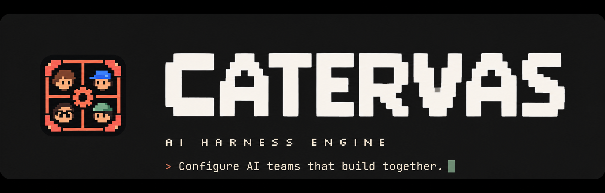
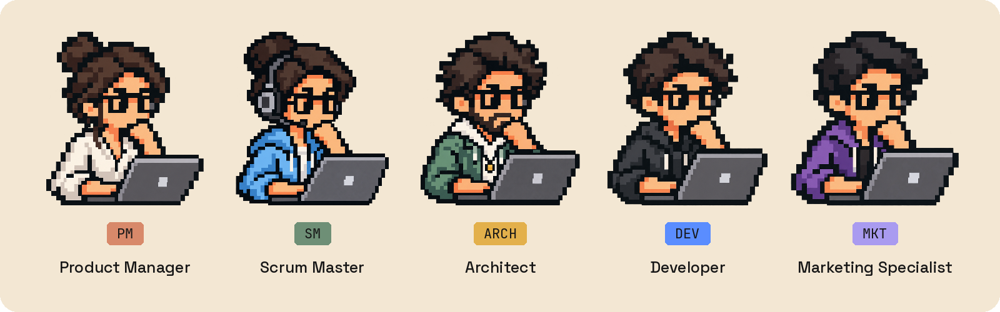

<div align="center">



<br>

**A production-grade harness system for multi-agent systems.**

[](https://github.com/abdshaat/Farik/actions/workflows/check.yml)
[](LICENSE)
[](rust-toolchain.toml)
[](#status)

[Why Farik](#why-farik) &nbsp;|&nbsp; [How it works](#how-it-works) &nbsp;|&nbsp; [The team](#meet-the-team) &nbsp;|&nbsp; [Quick start](#quick-start) &nbsp;|&nbsp; [Contributing](#contributing)

</div>

Farik is a production-grade harness system for multi-agent systems: it runs its own small team of AI agents (a Product Manager, a Scrum Master, an Architect, a Developer and a Marketing Specialist) against one git repository. They plan, build, review and ship together. A governance harness sits between every agent and every tool and decides, in code, what each of them may do. Your agents don't need more autonomy. They need a contract.

## Status

> [!NOTE]
> **Farik is pre-release.** The governance harness, agent runtime, team and browser app are built. You can set up a project, choose your team, ask for work and review its results in your browser. There is no installable release and no stable API yet. Star the repository to hear when there is.

## Why Farik

Point a swarm of agents at a repository and watch what breaks. It is rarely the model. It is that nothing stops the team from talking itself into a rewrite. Three weeks later nobody can reconstruct why a file changed or what it cost. And the agent that wrote the code is the same one that declares it correct.

The usual fix is a longer system prompt. But a prompt that says *never push to `main`* is a suggestion, and a model having a bad day will take it as one. Farik puts the rules in code that runs between the agent and the tool, where a bad day cannot reach them.

## How it works

| | |
|---|---|
| **A contract before any work** | No agent starts a task until it has a written contract. The contract holds the intent, exit criteria with a verification method for each, a budget, a risk level, an explicit out-of-scope list, and a named reviewer. |
| **Nobody grades their own homework** | The reviewer is never the assignee. Verification runs in a fresh session that sees the contract, the diff and the tools to run the criteria, never the author's transcript. |
| **Governance is code, not prompts** | A deterministic governor checks every permission, budget, iteration limit and path allowlist. Agents propose and the governor decides. An instruction injected through the repository can make an agent *request* a push, and the request comes back denied. |
| **You approve what matters** | Every decision that is yours arrives as a plain-language summary written by the agent that asks, with Farik's own check results and the code changes one click away. Those decisions are approving a plan, accepting risky work, and answering a question. |
| **Bounded by default** | Every session has token, time, tool-call and iteration limits. Spending limits are optional. Hitting a limit escalates to you, so nothing runs away. |
| **A complete audit trail** | Every tool call, state change, message and dollar lands in an append-only log. Contracts and decisions are plain files in your repository, so they diff and review like code. |
| **Local first** | The orchestrator runs on your machine and agents execute in a sandbox there. Your code never leaves it. |

## Meet the team

<p align="center">

</p>

A team has two to seven agents. Each has its own name, avatar, persona, model settings, tools, MCP servers and skills, and one of five roles, with a sixth, the Finance Specialist, planned. Two developers is a common choice. Farik ships ten characters, and any agent can wear any of them.

| Role | What it does | What it may not do |
|---|---|---|
| **Product Manager** | Turns your requests into contracts after asking you its questions, owns the backlog and the product documents, and accepts work against its contracts. | Write application code, or accept work that no reviewer has verified. |
| **Scrum Master** | Triages requests, breaks approved plans into tasks, assigns them, and runs planning, standup, review and retro. | Change a plan's requirements, write application code, or accept work. |
| **Architect** | Holds the shape of the system: writes decision records, sets constraints for contracts, and reviews the Developer's changes. | Write application code, push shared branches, or accept work. |
| **Developer** | Implements contracts on `feature/` or `fix/` branches and runs the exit criteria before declaring done. It is the only role that writes application code. | Change a contract, accept its own work, or touch files outside the contract's paths. |
| **Marketing Specialist** | Researches the market and writes the marketing plan, release notes, landing copy and positioning. | Change application code, or publish anywhere without your approval. |
| **Finance Specialist** (planned, optional) | Keeps the product's books in spreadsheets you can open. It tracks what the team spends on AI, reads Stripe, picks up receipts from a receipts mailbox you forward to, and forecasts long-term costs. The books stay private on your machine, never in the repository. | Write code, change your mail or Stripe, pay or move money, or publish anything. |

## How a task moves

A request becomes a plan (an epic) or a single task. Nothing starts until its contract is ready, and nothing is accepted until a reviewer has run every criterion and recorded the evidence.

```
draft ──▶ refining ──▶ ready ──▶ assigned ──▶ in_progress ──▶ verifying ──▶ accepted
             │            │          │             │              │
             │            │          │             ▼              ▼
             │            │          │          blocked        rejected ──▶ in_progress
             │            │          │             │                          (bounded)
             ▼            ▼          ▼             ▼
         escalated    escalated  escalated ──▶ you decide ──▶ any state, or cancelled
```

The governor alone moves a task between the states it owns, and every refusal comes with a reason. When an agent runs out of budget, gets blocked, or fails review three times, the task escalates to you rather than grinding on.

## Quick start

Farik runs on your computer and opens in your web browser. After the first setup, you ask for work and review the team's results there.

There is no downloadable installer yet. This early version needs a one-time setup in Terminal, the app where you paste commands. If you have never installed developer tools, ask someone who has to help with this part.

### 1. Prepare your computer

Install these tools before continuing:

- **Git**, to download Farik. Use version 2.31 or newer.
- **Node.js 24.14.0 and pnpm 12.3.4**, to prepare the browser app. The repository pins these versions in `.node-version` and `package.json`.
- **[Rust through rustup](https://rustup.rs)**, to build Farik. The repository's `rust-toolchain.toml` selects the required version automatically.
- **[Claude Code](https://docs.claude.com/en/docs/claude-code)**, to run the AI team. You will connect a Claude subscription or an API key during setup in the browser.
- **Docker**, to give the agents a separate workspace for running their tools. Start Docker before opening Farik.

The browser setup checks your computer and explains anything missing.

### 2. Download and prepare Farik

Open Terminal. Copy each line below, paste it into Terminal, and press Enter. Wait for each command to finish before running the next. The first build may take several minutes.

```bash
git clone https://github.com/abdshaat/Farik.git
cd Farik
pnpm install --frozen-lockfile
pnpm -r --if-present generate
pnpm --filter @farik/web build
cargo build --release
```

If you already downloaded Farik, open Terminal in its `Farik` folder and run `git pull --ff-only origin main` instead of the first two lines. Then run the remaining commands to prepare the updated version.

### 3. Open Farik

From the same Terminal window, run:

```bash
./target/release/farik serve
```

Farik opens your browser. If it does not, copy the full connection link printed in Terminal into your browser's address bar. It usually starts with `http://127.0.0.1:7420/connect#`. Use the full link, including everything after `#`, to connect that browser.

On your first visit, follow the setup screens to:

1. Check your computer and fix any missing tools.
2. Connect your Claude account. For a subscription, the screen explains how to get a token with `claude setup-token`; for an API key, paste the key into the form.
3. Choose an existing project folder or create a new project.
4. Choose your team and review its permissions and checks.
5. Finish setup and describe the work you want in the browser.

Farik remembers your project. To use it again, open Terminal in the `Farik` folder and run the same `serve` command. Keep that Terminal window open while using Farik. To stop it, return to Terminal and press **Ctrl+C**.

### Command-line reference

The browser is the main way to use Farik. The commands below are also available for people who prefer Terminal. Examples use `farik` as shorthand for the executable built above; run project commands from the folder of the project you want the team to work on.

#### Commands

| | Command | What it does |
|---|---|---|
| **Set up** | `farik init` | Make the repository a Farik project, or rescan it |
| | `farik rules show` | Print the team rules every action is held to |
| | `farik criteria list` | Print every criterion a contract may refer to by name |
| **Ask** | `farik task create <file>` | File a contract as a draft request |
| | `farik contract new` | File a request from a brief or an issue, and write its contract with the Product Manager |
| | `farik triage <id> <large\|small>` | Record how big a request is, or overrule the triage |
| | `farik contract lock <id>` / `unlock <id>` | Take a contract from the team, or give it back |
| **Open** | `farik serve` | Open the browser app and keep the team available until stopped |
| **Run** | `farik run` | Drive the team until nothing needs doing, a stop, or Ctrl-C |
| | `farik plan` | Triage, contract, break down and assign, without starting any work |
| | `farik sprint start` / `end` / `show` | Start, end, or show a sprint, with an optional budget |
| | `farik stop` | Stop the run after its session, or stop one session now |
| **Decide** | `farik approve <id>` | Approve a contract that awaits your approval |
| | `farik accept <id>` | Accept a result that waits for you |
| | `farik answer <question> <answer>` | Answer a question an agent asked |
| | `farik resolve <id> <status> <message>` | Resolve an escalation, with a message for the next session |
| | `farik integrate <id>` | Integrate an accepted task now |
| | `farik cancel <id> <reason>` | Cancel a task |
| **Talk** | `farik say <text>` | Post in the team channel; `@<id>` mentions an agent |
| | `farik channel` | Show the team channel |
| **Read** | `farik board` | The lifecycle, one line per task |
| | `farik task show <id>` | One contract and everything that happened to it |
| | `farik log` | The event log, filtered by `--task`, `--kind` or `--limit` |
| | `farik metrics` | The harness metrics for the project or one sprint |
| | `farik doctor` | Every way the files and the log disagree |

## Open source

Farik is Apache 2.0 and always will be. A hosted tier is planned for people who would rather not run it themselves, but nothing that makes the agents safer or more controllable will ever be paid for. A governance layer you cannot audit is not one you should trust with your repository.

## Contributing

Farik holds itself to the discipline it imposes on its agent teams: no code before a failing test, no completion claim without pasted evidence, and nobody approves their own pull request. Start with [CONTRIBUTING.md](CONTRIBUTING.md); it is short.

The [specification](docs/SPEC.md) is the place to argue with the design. The [architecture decisions](docs/decisions/) record why things are the way they are, and the [brand](docs/brand/brand.md) says how Farik looks and speaks. Issues and discussions are welcome, especially from anyone who has watched an agent team fail in a way this harness would not have caught.

## License

[Apache 2.0](LICENSE).

<br>

<div align="center">

<br>
<sub>Plan. Build. Iterate. Ship together.</sub>
</div>
